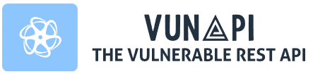

# VuNAPI

**The Vulnerable NestJS API** _(Based on OpenAPI 3)_



VuNAPI is a vulnerable API made with NestJS that contains various vulnerabilities. During my thesis on fuzzing, I found that previous vulnerable APIs did not meet my requirements, so I decided to implement this application. It includes an on/off switch to enable vulnerabilities for specific scenarios and allows you to choose the type of authentication you want to use. VuNAPI can also be used for learning and teaching purposes.

You can find more details about the vulnerabilities in [this document](./Vulnerabilities.md).

## ✨ Features

- 📄 OpenAPI3 specs included.
- 🔄 Global switch to toggle specific vulnerable scenarios.
- 🔒 Selectable authentication methods: JWT, Basic, or no authentication.
- 🖥️ Available Swagger UI to directly interact with the API.

## 📜 Swagger / OpenAPI Specification

| **Action**  | **Path**         | **Details**                                   |
| :---------- | :--------------- | :-------------------------------------------- |
| **default** |
| HEAD        | /isAlive         | Check if VuNAPI is running                    |
| GET         | /testStatusCodes | Returns different status codes than specified |
| GET         | /kill            | Shut down the server                          |
| **person**  |
| POST        | /person          | Create a new person                           |
| PUT         | /person/{id}     | Update data of a person                       |
| DELETE      | /person/{id}     | Delete a person                               |
| **persons** |
| GET         | /persons         | Retrieve all persons                          |
| GET         | /persons/{id}    | Retrieve specific person by ID                |
| **login**   |
| POST        | /login           | Login to VuNAPI                               |

For more details, you can either run VuNAPI and visit `http://127.0.0.1:3000/api` or use a service like the [Swagger Editor](https://editor.swagger.io) by supplying the OpenAPI specification which can be downloaded from `http://127.0.0.1:3000/api-json`.

## 🚀 Run it

VuNAPI is designed to work with Docker. This is the only way to enable/disable different vulnerabilities and choose between various authentication methods.

Before starting VuNAPI, you must first decide which authentication method to use.

### 🔑 Authentication

You can choose between three types of authorization: `no-auth`, `basic-auth`, or `jwt-auth`.
For example, to run VuNAPI without authentication, simply run in the root directory:

```sh
docker-compose up --build no-auth
```
